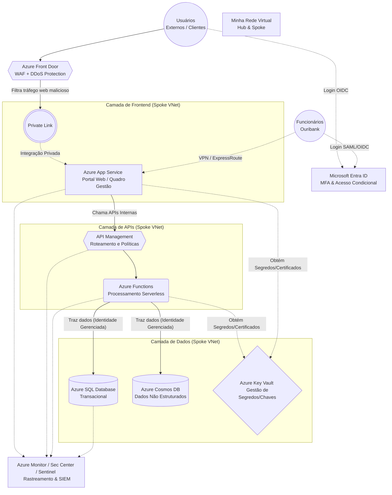

# Planejamento da Arquitetura: Criação de quadro no Azure - Ouribank

Este documento servirá como base para detalhar a arquitetura do projeto "Criação de quadro no Azure" para o Ouribank.

## Premissas da Arquitetura (Azure Best Practices para Setor Financeiro)

Como não especificamos a finalidade exata do "Quadro" (Dashboard Analítico vs Quadro de Gestão Web), propomos uma **Arquitetura Web Segura de Nível Bancário** (Banking-Grade Secure Web Architecture), baseada no **Microsoft Azure Well-Architected Framework**, ideal para Portais, Dashboards ou Sistemas Core transacionais para o Ouribank.

Os pilares da arquitetura:
1.  **Segurança e Conformidade (Zero Trust):** Sem exposição direta à internet (Private Endpoints) e gestão de acessos com Entra ID (MFA e Acesso Condicional), suportando conformidade (ex: Bacen/LGPD).
2.  **Alta Disponibilidade (Resiliência):** Serviços distribuídos em Availability Zones (AZ) e redundância.
3.  **Modernização (PaaS e Serverless):** Foco na regra de negócio e não no gerenciamento de máquinas virtuais.
4.  **Observabilidade Transversal:** Rastreamento ponta-a-ponta via Azure Monitor.

## Arquitetura Proposta: Azure Secure Web Portal (Ouribank)

## Próximos Passos (Revisão Time AIOS)
1. **Infraestrutura como Código (IaC):** Conforme alinhado pela engenharia DevOps, provisionaremos todos esses recursos usando **Terraform** ou **Bicep**, evitando criação manual de infraestrutura (garantindo versionamento).
2. **Definição de Deployment Slots:** O *Azure App Service* será configurado com slots para permitir *Zero-Downtime Deployments* das novas versões do Portal Gestão.
3. **Plano de Execução Serverless:** Configuração do *Azure Functions* em **Premium Plan** para eliminar o problema de *Cold Start* que afeta SLAs financeiros, e ativação de integração VNet nativa.
4. **Segurança de Dados Avançada:** Ativação do **Row-Level Security (RLS)** nativo no *Azure SQL* como camada extra de isolamento multitenant, garantindo que usuários logados via Entra ID só enxerguem os dados pertencentes aos seus domínios legais.
